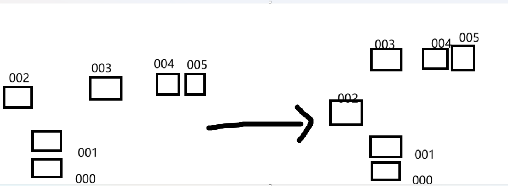

# C-5.0.4 机械臂启动姿态手动调参工具与基线

日期：2026-06-11

## Summary

- 新增远程桌面交互调参工具：`tools/arm_servo_tune.py`。
- 新增一键保存启动姿态工具：`tools/save_arm_start_pose.py`。
- 用户已在实机上保存一版当前最稳定启动姿态：
  - `000=1500`
  - `001=1907`
  - `002=1900`
  - `003=900`
  - `004=1500`
  - `005=1500`
- 该姿态已写入香橙派 `~/rk3588_ai/arm_tracking_demo/config/arm_track_config.yaml`，并拉回仓库。

## 姿态目标草图



## 工具用法

进入交互调参：

```bash
cd ~/rk3588_ai/arm_tracking_demo
~/rk3588_ai/rknn_lite_env/bin/python3 tools/arm_servo_tune.py
```

常用交互命令：

```text
read 0-5
set 2=1900,3=900 1500
nudge 2=-50 1000
nudge 3=50 1000
save 0-5
quit
```

一键保存当前读回姿态：

```bash
cd ~/rk3588_ai/arm_tracking_demo
~/rk3588_ai/rknn_lite_env/bin/python3 tools/save_arm_start_pose.py --ids 0-5
```

如果某个舵机能动作但 `PRAD` 偶发读空，直接保存显式值：

```bash
~/rk3588_ai/rknn_lite_env/bin/python3 tools/save_arm_start_pose.py \
  --values 0=1500,1=1907,2=1900,3=900,4=1500,5=1500
```

## 保存结果

保存后的关键配置：

```yaml
driver:
  yaw_pwm_neutral: 1500
  pitch_pwm_neutral: 900
  hold_servo_pwms: [1500, 1907, 1900, 900, 1500, 1500]
  tracking_pose_pwms:
    0: 1500
    1: 1907
    2: 1900
    3: 900
    4: 1500
    5: 1500
```

`tracking_pose_stages` 分两段执行：

1. `001=1907, 002=1900`，先调整承重主臂。
2. `000=1500, 003=900, 004=1500, 005=1500`，再调整底座/腕部/末端。

## 实机状态

- 香橙派配置已确认保存上述姿态。
- 当前 `/dev/ttyUSB0` 被 `python3 tools/arm_servo_tune.py` 占用，说明用户远程桌面调参工具仍在运行。
- 发布时不强杀该进程，避免打断用户已打开的调参会话。

## 注意

- `003` 在电池电量低或末端负载较大时，抬高后可能不动或无 `PRAD` 回包。
- 当前这组姿态是用户确认的“完美启动姿势”，后续不要再用代码侧猜测覆盖。
- 若重新调姿，必须先用 `arm_servo_tune.py` 看实物调整，再用 `save_arm_start_pose.py` 保存。
